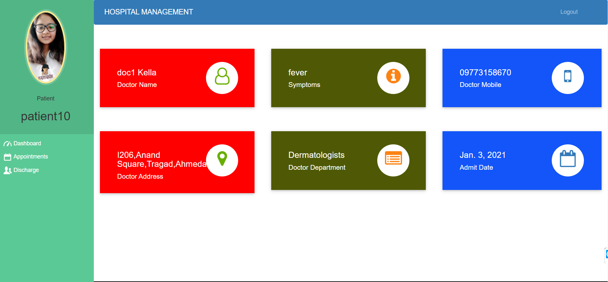

# Hospital Management System

## Admin
  - Sign Up their account. Then Login (No approval Required).
  - Sign Up their account. Then Login (No approval Required).
  - Can register/view/approve/reject/delete doctors (approve those doctors who applied for a job in their hospital).
  - Can admit/view/approve/reject/discharge patient (discharge patient when treatment is done).
  - Can Generate/Download Invoice pdf (Generate Invoice according to medicine cost, room charge, doctor charge and other charge).
  - Can view/book/approve Appointment (approve those appointments which are requested by the patient).
  
  **Admin Page**
   

## Doctor
- Apply for job in hospital. Then Login (Approval required by hospital admin, Then only doctor can login).
- Can only view their patient details (symptoms, name, mobile ) assigned to that doctor by admin.
- Can view their discharged(by admin) patient list.
- Can view their Appointments, booked by admin.
- Can delete their Appointment, when doctor attended their appointment.

**Doctor Page**
 

## Patient
- Create account for admit in hospital. Then Login (Approval required by hospital admin, Then only patient can login).
- Can view assigned doctor's details like ( specialization, mobile, address).
- Can view their booked appointment status (pending/confirmed by admin).
- Can book appointments.(approval required by admin)
- Can view/download Invoice pdf (Only when that patient is discharged by admin)

**Patient Page**
 

**Invoice Generation**
 
 

#HOW TO RUN THIS PROJECT
- install requirements.txt
- open terminal and set the project folder path 
- Execute following commands 
  - py manage.py makemigrations
  - py manage.py migrate
  - py manage.py runserver
- http://127.0.0.1:8000/ enter this URL in PC-Browser
 
 
 
 ## Author 
 For any doubts please contact Khushbu Kella

 
